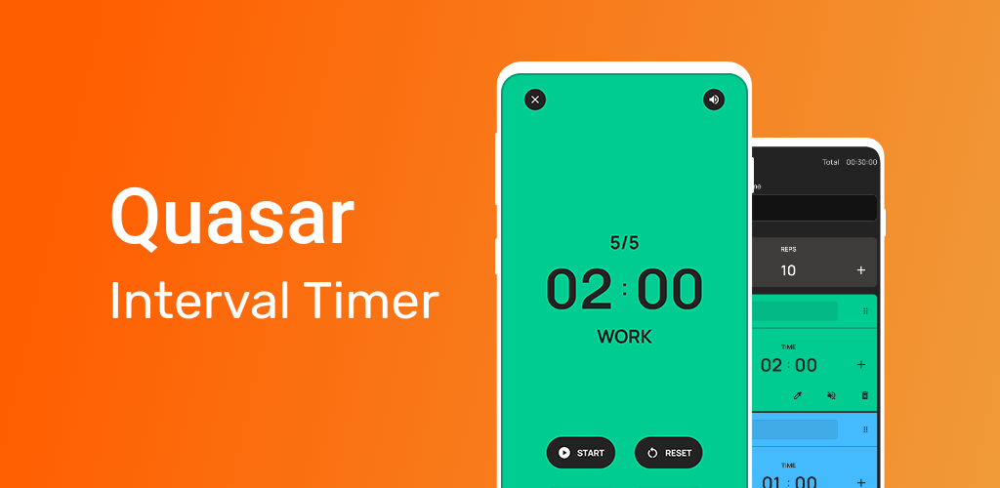
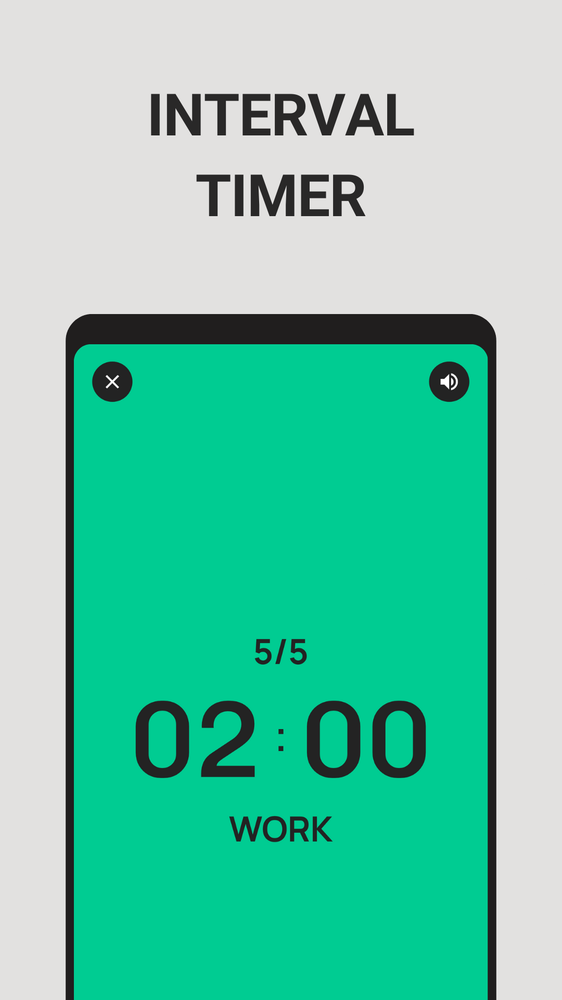
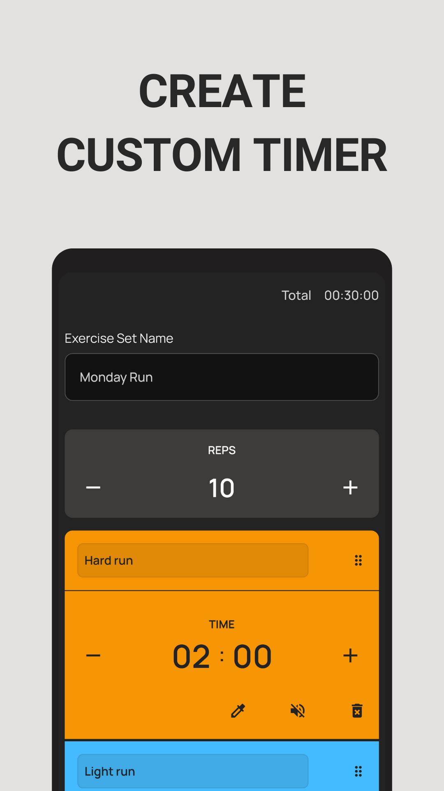
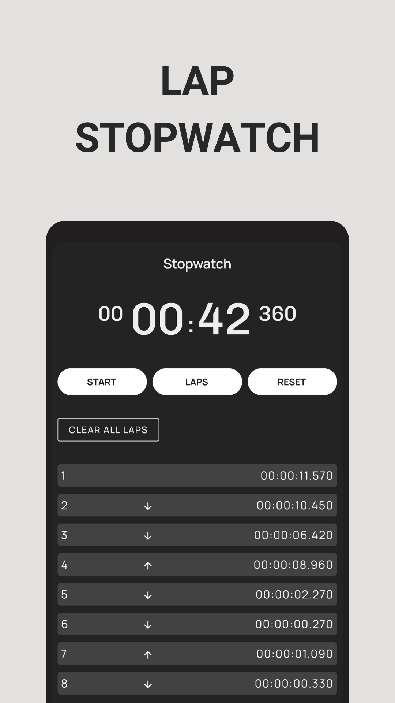
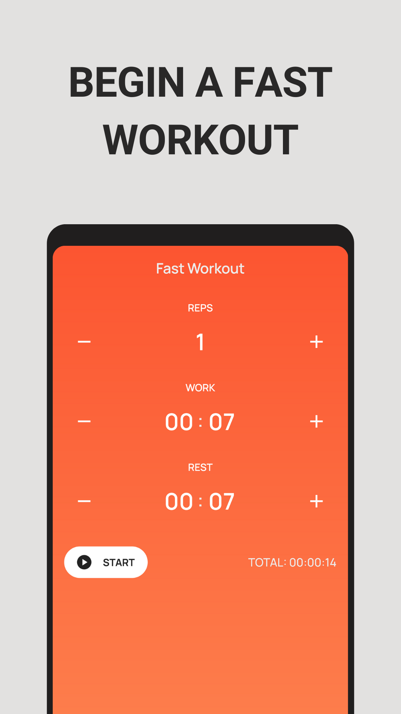
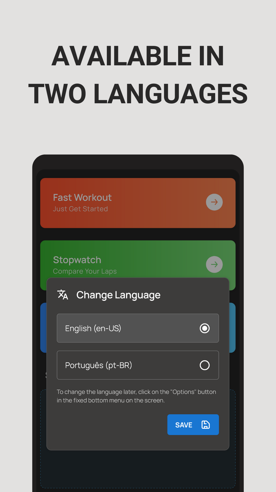

  

<h2 style="border-bottom:none;">About</h2>

The Quasar Interval Timer is an app with timer functions to help you track the time of your workouts.

<h3>Features:</h3>

- Quick Workout Timer: Start a custom workout timer quickly for your exercise sessions.

- Customizable Timer: Create custom timers according to your specific needs. Save and reuse these timers for added convenience.

- Stopwatch with Lap Records: Use the stopwatch with the ability to record laps and easily track your progress.

- Sound Notifications: Choose to enable or disable sound notifications to stay informed about elapsed time.

- Runs in the Background: The Quasar Interval Timer continues to run in the background if a timer is active, allowing you to use other apps while monitoring your time.

- Clean and user-friendly design.

<h2 style="border-bottom:none;">Live preview</h2>

Google Play Store: [https://play.google.com/store/apps/details?id=com.quasarintervaltimer.app](https://play.google.com/store/apps/details?id=com.quasarintervaltimer.app)

<h2 style="border-bottom:none; padding-top: 16px;">Screenshots</h2>

<h2 style="border-bottom:none;">Technologies and Tools</h2>

- [Quasar Framework](https://quasar.dev/)
- [Capacitor](https://capacitorjs.com/)
- [Vue.JS](https://vuejs.org/)
- [Vuex](https://vuex.vuejs.org/)
- [Vue Router](https://router.vuejs.org/)
- [Sass (SCSS)](https://sass-lang.com/)

<h2>Contact me</h2>

- [Linkedin](https://www.linkedin.com/in/gregorydom/)
- [Github](https://github.com/gregdom)
